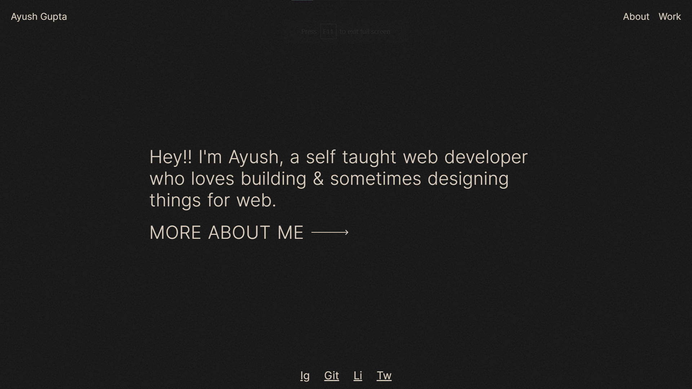

<!-- @format -->

<h2 align="center"> V2 - ayushguptaa.com 🕸</h2>



<p align="center">
  The 2nd version of <a href="https://ayushguptaa.com" target="_blank">ayushguptaa.com</a> built with <a href="https://www.nextjs.org/" target="_blank">Nextjs</a> and <a href="https://sanity.io/" target="_blank">Sanity.io</a>
</p>

## Requirements 🚀

For development, you will only need Node.js and a node global package, npm or Yarn, installed in your environement.

## Install 📦

```sh
npm install
```

## Dev Server 🔌

```sh
npm run dev
```

## Build Server 🏭

```sh
npm run build
```
##  Tech Stack 🔮
- Next.js
- SCSS
- Sanity CMS
- Gsap

## Author

👤 **Ayush Gupta**

-   Website: ayushguptaa.com
-   Twitter: [@ayushgptaa](https://twitter.com/ayushgptaa)
-   Github: [@ayushgptaa](https://github.com/ayushgptaa)
