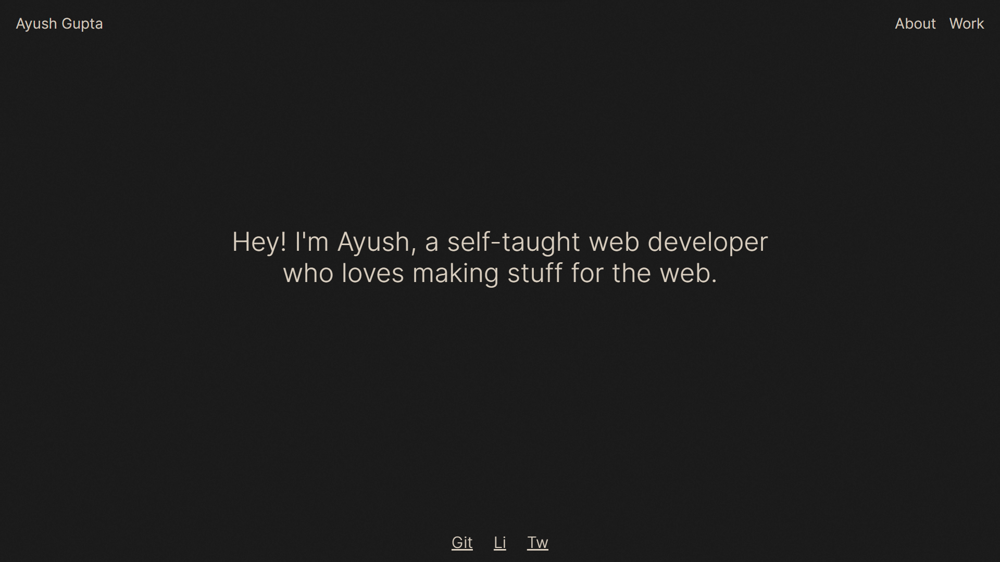
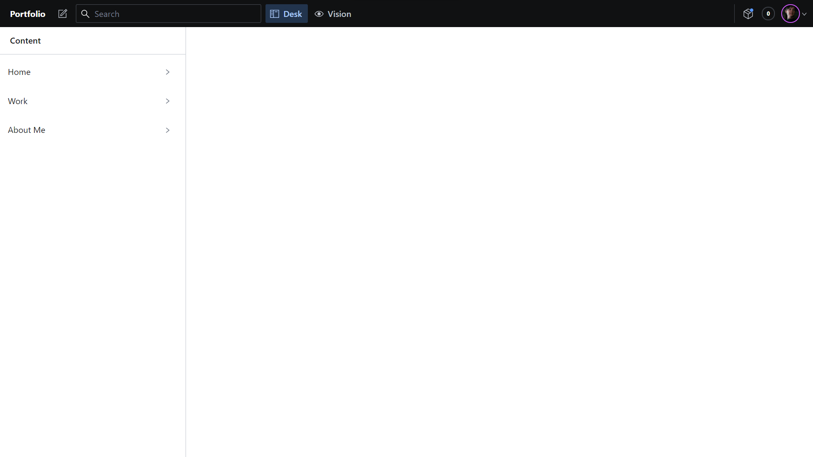

<h2 align="center"> V2 - <a href='https://ayushguptaa.com'>ayushguptaa.com </a></h2>



<p align="center">
  The 2nd version of <a href="https://ayushguptaa.com" target="_blank">ayushguptaa.com</a> built with <a href="https://www.nextjs.org/" target="_blank">Nextjs</a> and <a href="https://sanity.io/" target="_blank">Sanity.io</a>
</p>
<br>

## How to setup Sanity 🚀

Below are the steps on how to setup sanity studio :

<p>
1. Create a <a href="https://www.sanity.io/login/sign-up">Sanity</a> account <br>
2. Click on create new project <br>
3. Choose "start with command line".

```
npm install -g @sanity/cli sanity init
```

### Important 🚨

Select **" Clean project with no predefined schemas "** when creating the sanity studio using sanity init.<br>
<br> 4. Find schema folder in this repo and replace it with the schema present in your created studio.<br> 5. Run this command.

```
sanity start
```

<br>
6. A dashboard like this will open in localhost:3333.


<br> 7. Just click on the content that you want to add. <br> 8. For more information see <a href="https://www.sanity.io/docs">Sanity docs</a>

## Development 🏗️

Create a .env file in root of your app and add these :

```
NEXT_PUBLIC_SANITY_PROJECT_ID= Your_propject_id
NEXT_PUBLIC_SANITY_DATASET=production
NEXT_PUBLIC_GOOGLE_ANALYTICS= Your_analytics_id
```

### Install 📦

```sh
npm install
```

### Dev server 🔌

```
npm run dev
```

### Build Server 🏭

```sh
npm run build
```

## Tech Stack 🔮

-   Next.js
-   SCSS
-   Sanity CMS
-   Gsap

## Author 🖋️

👤 **Ayush Gupta**

-   Website: ayushguptaa.com
-   Twitter: [@ayushgptaa](https://twitter.com/ayushgptaa)
-   Github: [@ayushgptaa](https://github.com/ayushgptaa)
